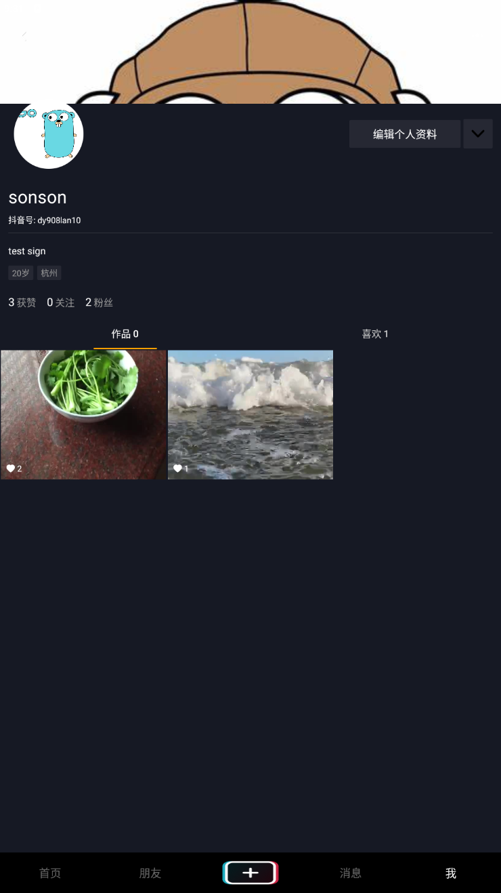
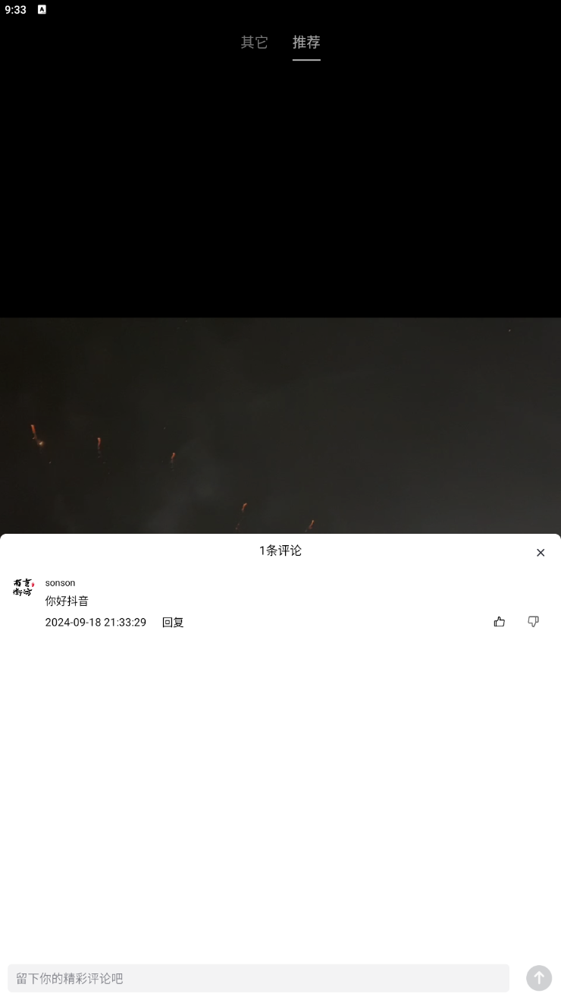
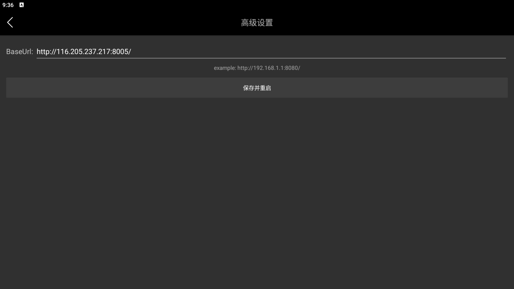
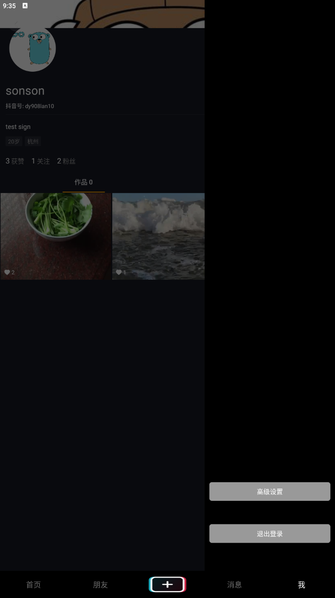
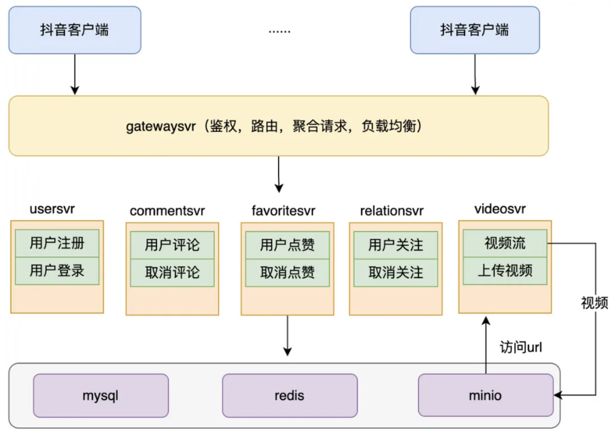

# tiktok
## 极简版抖音项目
> 背景：
>
> 极简版抖音后台是基于Java开发的一个可以提供
> 
> 用户注册登录
> 
> 视频Feed流
> 
> 视频上传
> 
> 点赞和评论
> 
> 等基础抖音功能的一个后台应用
> 
>

### 1.依赖环境

**jdk17   MySQL(数据库sql文件在deploy包下的initdb中)    minio   Redis    Nacos**

### 2.技术栈

-Spring Cloud
-Nacos
-Spring Cloud Gateway
-MyBatis
-Redis
-MySQL

### 功能

**用户注册登录、视频Feed流、视频上传、点赞和评论**

### 3.演示界面

#### **基础功能演示**

视频feed流：

登录注册：

发布视频：

查看用户主页信息：

​

</a>

#### **拓展功能演示**

发布评论：

网关信息输入：

 

退出登录：

查看关注和粉丝：

####业务流程图

