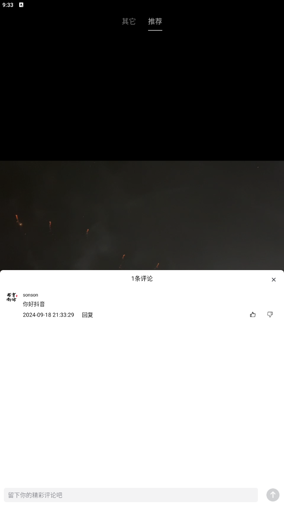
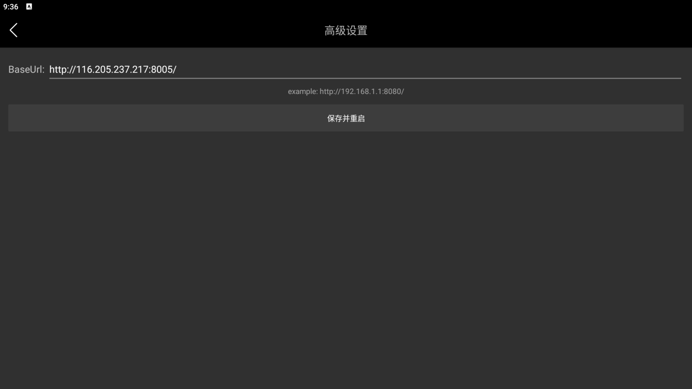
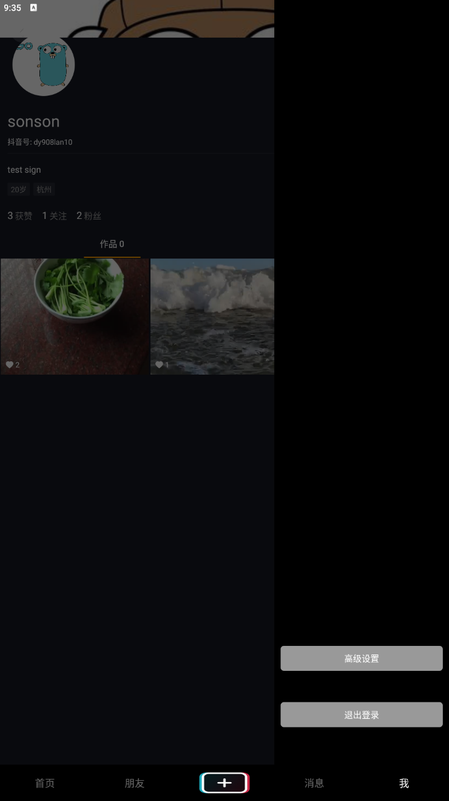

# tiktok

#### 依赖环境

**jdk17   MySQL(数据库sql文件在deploy包下的initdb中)    minio   Redis    Nacos**

#### 技术栈

**Spring Cloud + Nacos + Spring Cloud Gateway + MyBatis+Redis + MySQL**

#### 功能

**用户注册登录、视频Feed流、视频上传、点赞和评论**

## 演示界面

### **基础功能演示**

​
</a>

### **拓展功能演示**

  

